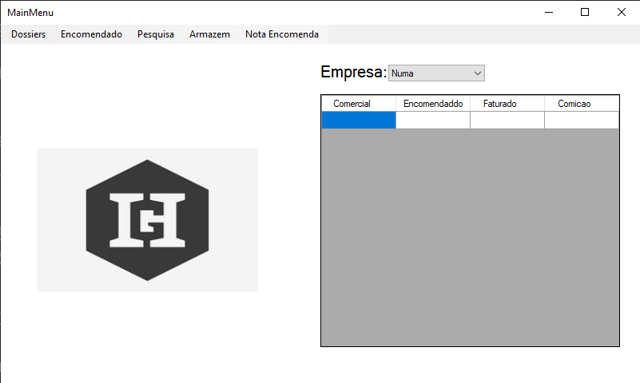
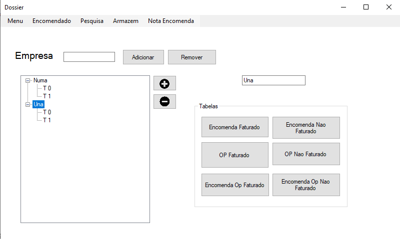
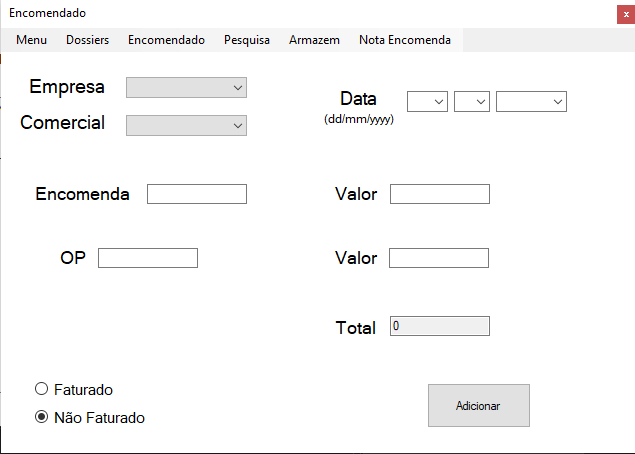
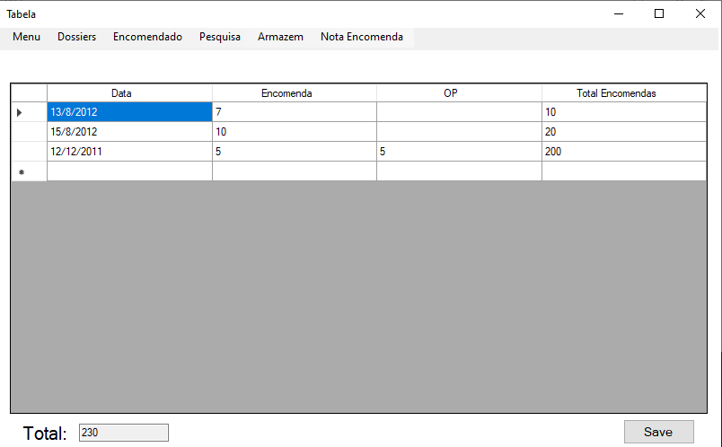

# AppDataFatura

Um aplicativo Windows Forms desenvolvido em C# para gerenciar empresas, departamentos comerciais, pedidos de clientes, informações de faturamento e controle de comissões.

O aplicativo oferece uma interface centralizada para cadastrar empresas, organizar equipes comerciais, registrar pedidos, pesquisar dados históricos e calcular valores faturados e comissões.

## Features

### Gestão da Empresa

- Criar e remover empresas
- Organizar as empresas em uma estrutura hierárquica
- Informações da empresa de armazenamento localmente

### Gestão do Departamento Comercial

- Crie departamentos comerciais para cada empresa.
- Associe pedidos a departamentos específicos.
- Visualize as relações comerciais da empresa por meio de uma representação em árvore.

### Registro de pedido

- Registe:
  - Número do pedido
  - Número da operação (OP)
  - Data
  - Valor do pedido
  - Status da fatura
- Acompanhe o histórico de pedidos por departamento comercial.

### Acompanhamento Financeiro

- Calcular os valores faturados
- Rastrear totais de pedidos
- Fluxos de trabalho de suporte para cálculo de comissões

### Sistema de pesquisa

Pesquise pedidos usando:
- Número do pedido
- Número OP
- Data

### Persistência de dados

- Serialização binária local
- Carregamento automático de dados empresariais salvos
- Operação offline sem bancos de dados externos

---

## Tech Stack

- C#
- .NET Framework 4.6.1
- Windows Forms (WinForms)
- Object-Oriented Programming (OOP)
- Binary Serialization
- DataGridView
- TreeView Controls

---

## Project Structure

```text
AplicacaoNotAlone
│
├── MainMenu.cs        # Painel principal
├── Dossier.cs         # Gestão de empresa e departamento
├── Encomendado.cs     # Registro de pedido
├── Pesquisa.cs        # Funcionalidade de pesquisa
├── Tabela.cs          # Visualização de dados
│
├── Empresa.cs         # Modelo de empresa
├── Comercial.cs       # Modelo de departamento comercial
├── Encomendas.cs      # Modelo de pedido
│
├── SaveLoad.cs        # Sistema de persistência binária
└── Program.cs         # Ponto de entrada do aplicativo
```

---

## Architecture

A aplicação segue uma arquitetura orientada a objetos simples.

### Core Entities

#### Empresa
Representa uma empresa.

```csharp
Empresa
 └── List<Comercial>
```

#### Comercial
Representa um departamento comercial.

```csharp
Comercial
 └── List<Encomendas>
```

#### Encomendas
Representa um pedido que contém:

- Número do pedido
- Número OP
- Data
- Montante total
- Status da fatura

---

## Data Storage

O aplicativo armazena informações localmente usando serialização binária.

Exemplo:

```csharp
empresas.SaveBinary("Saves", "empresasInfo");
```

Os dados são carregados automaticamente quando o aplicativo é iniciado.

---

## Screenshots

### Main Menu


### Gestão da Empresa


### Registro de pedido


### Resultado de pesquisa


---

## How to Run

### Requirements

- Visual Studio 2017 or newer
- .NET Framework 4.6.1

### Steps

1. Clone the repository

```bash
git clone https://github.com/Excalibur202/AppDataFatura.git
```

2. Open:

```text
AplicacaoNotAlone.sln
```

3. Build and run the solution.
